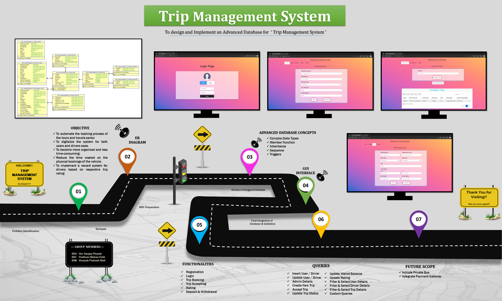
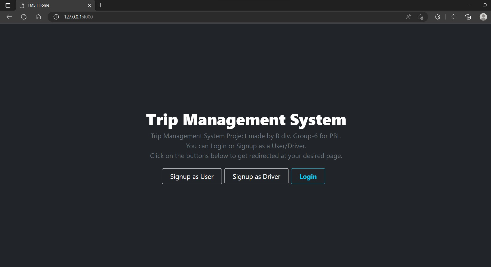
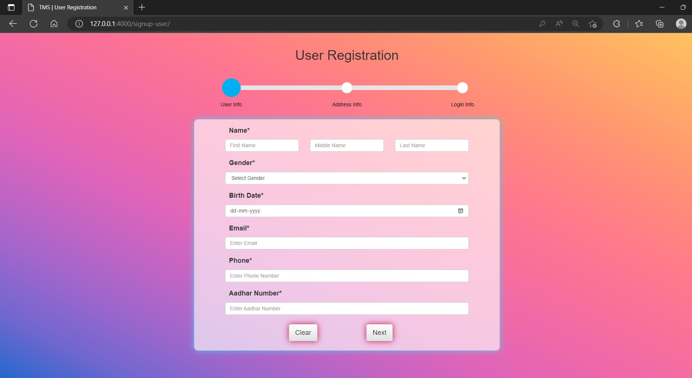
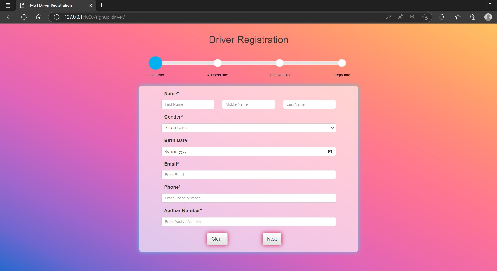
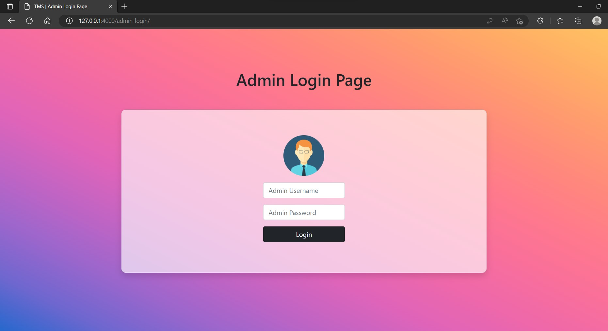
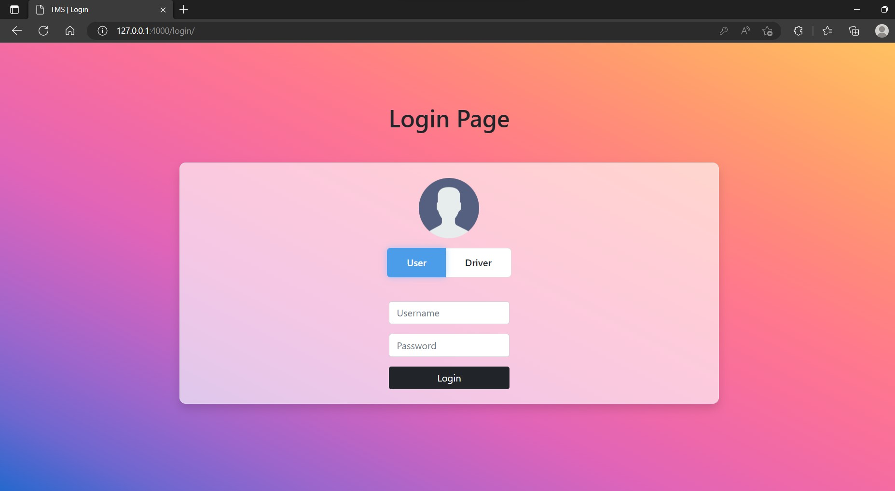
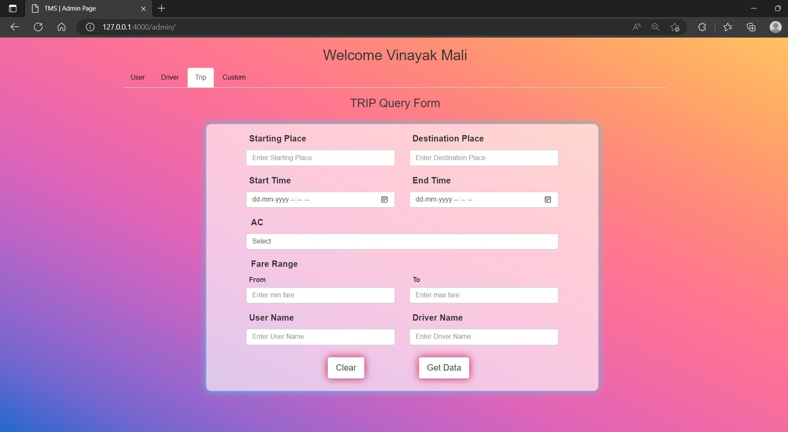
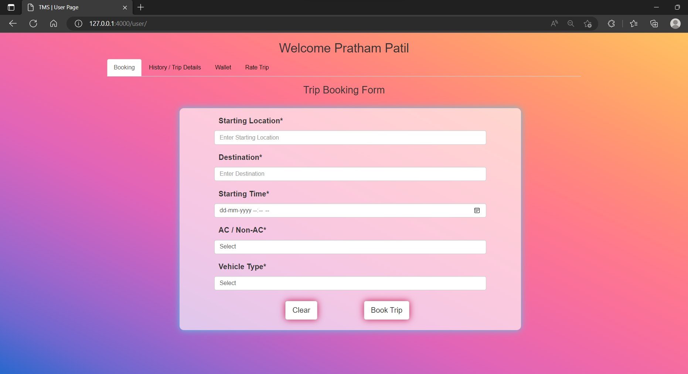
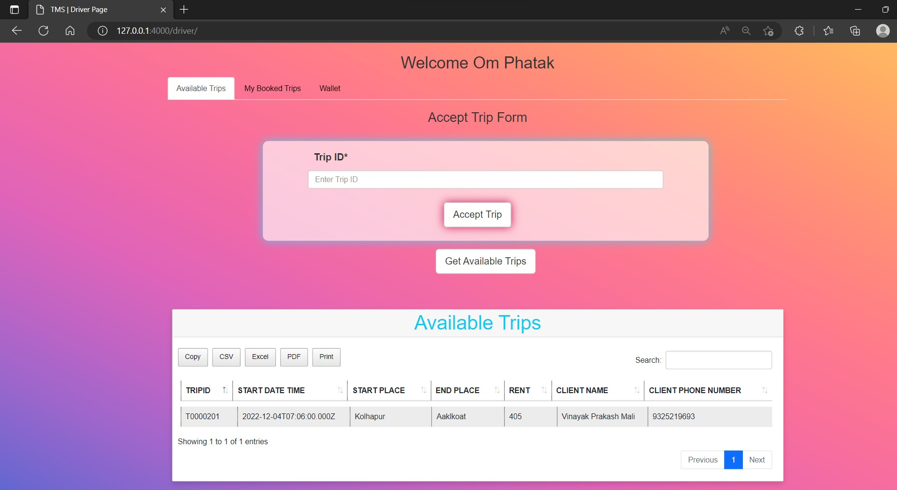

<h1> Trip Management System with Advance Database </h1>

**Table of Contents**

- [Problem Statement:](#problem-statement)
- [Road Map](#road-map)
- [Goals](#goals)
- [Functions And Features](#functions-and-features)
- [GUI](#gui)
  - [Home Page](#home-page)
  - [Registration](#registration)
  - [Login](#login)
  - [Dashboard](#dashboard)
- [Advance Database Concepts](#advance-database-concepts)
  - [Inheritance](#inheritance)
  - [Sequence](#sequence)
  - [Trigger](#trigger)
- [Future Scope](#future-scope)
- [Team Member](#team-member)
- [References](#references)

## Problem Statement: 
To design and implement a database for the `Trip Management System`.

## Road Map

## Goals
- Manage all details of clients who registered and requested for getting the service.   
- Create employee accounts and maintain the data effectively.   
- View all the details of the clients and employees (drivers). 
- Calculating the fare for trip according to selected options.
- Getting a rating from the client to facilitate a reward facility for employee. 

## Functions And Features

 

## GUI

### Home Page

> 
	
>   
Home Page UI

> 
>    
>   
> 

>

### Registration

> 
	
>   
User Registration UI

> 
>    
>   
> 

>
>
> 
	
>   
Driver Registration UI

> 
>    
>   
> 

>
> 
### Login

> 
	
>   
Admin Login UI

> 
>    
>   
> 

>
>
> 
	
>   
User-Driver Login UI

> 
>    
>   
> 

>

### Dashboard

> 
	
>   
Admin Dashboard UI

> 
>    
>   
> 

>
> 
	
>   
User Dashboard UI

> 
>    
>   
>    
> 

>
> 
> 
	
>   
Driver Dashboard UI

> 
>    
>   
> 

>

## Advance Database Concepts

### Inheritance

> Is-A relation between 
> 1. Person-Admin
> 2. Person-User
> 3. Person-Driver

### Sequence

> Sequence is used to auto-increment ID's of following tables
> 1. Trip Table
> 2. CBS[Central Bank System] Table
> 3. User Personal Trip History Table
> 4. Driver Personal Trip History Table
> 5. Rating Table

### Trigger

> Triggers are used implicitly run, or fired, on following table
> 1. On **Trip Booking**
>       - Update Trip ID as per `next.seq` appending **T** and beginning
>       - Update CBS ID as per `next.seq` appending **CBS** and beginning
>       - Insert trip entry in user history table
>       - 10% of trip rent will be set as commission and reaming as trip fare
>       - Deduct trip rent from user wallet
> 2. On **Trip Accepting**
>       - Insert trip entry in driver history table
>       - Deposit trip fare to driver wallet
>       - Update trip status as accepted
> 3. On Successful **Rating**
>       - 5% of trip rent will be deposited to driver wallet

## Future Scope
- Live Tracking of Taxi/Private Car
- Including Private Bus
- Taxi Pooling
- Payment Integration

## Team Member

## References
1. http://msdn.microsoft.com/en-us/library/ms130214
1. http://www.chambers.com.au/glossary/software_requirements_specificat ion.php
1. https://www.coursehero.com/file/68257404/srs-online-taxi-bookingdoc/