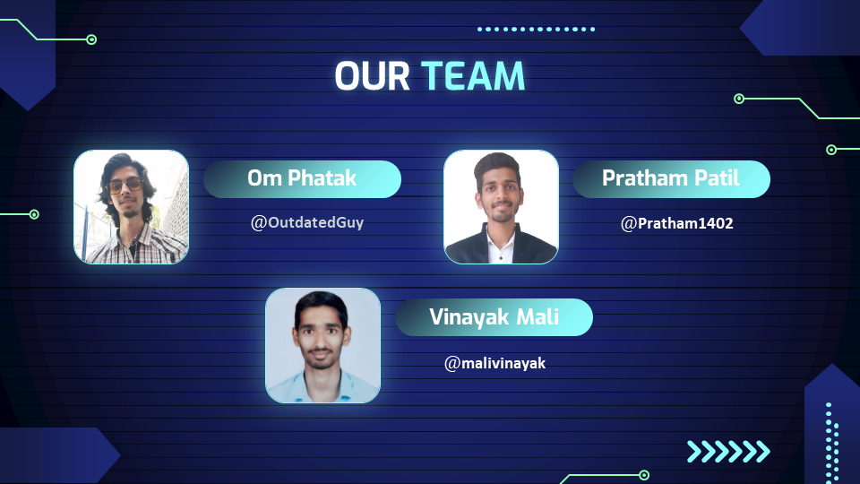

# Trip Management System with Advance Database

## Problem Statement: 
To design and implement a database for the `Trip Management System`.

## Road Map

## Goals
- Manage all details of clients who registered and requested for getting the service.   
- Create employee accounts and maintain the data effectively.   
- View all the details of the clients and employees (drivers). 
- Calculating the fare for trip according to selected options.
- Getting a rating from the client to facilitate a reward facility for employee. 

## Functions And Features

 

## GUI

### Home Page
> 
	
>   
Home Page UI

> 
>    
>   
> 

### Registration

> #### User Registration
> > 
	
> >   
User Registration UI

> > 
> >    
> >   
> > 

> #### Driver Registration
> > 
	
> >   
Driver Registration UI

> > 
> >    
> >   
> > 

### Login

> #### Admin Login
> > 
	
> >   
Admin Login UI

> > 
> >    
> >   
> > 

> #### User-Driver Login
> > 
	
> >   
User-Driver Login UI

> > 
> >    
> >   
> > 

### Dashboard

> #### Admin Dashboard
>
> > 
	
> >   
Admin Dashboard UI

> > 
> >    
> >   
> > 

>
> #### User Dashboard
> > 
	
> >   
User Dashboard UI

> > 
> >    
> >   
> >    
> > 

> 
> #### Driver Dashboard
> > 
	
> >   
Driver Dashboard UI

> > 
> >    
> >   
> > 

## Future Scope
- Live Tracking of Taxi/Private Car
- Including Private Bus
- Taxi Pooling
- Payment Integration

## Team

## References
1. http://msdn.microsoft.com/en-us/library/ms130214
1. http://www.chambers.com.au/glossary/software_requirements_specificat ion.php
1. https://www.coursehero.com/file/68257404/srs-online-taxi-bookingdoc/